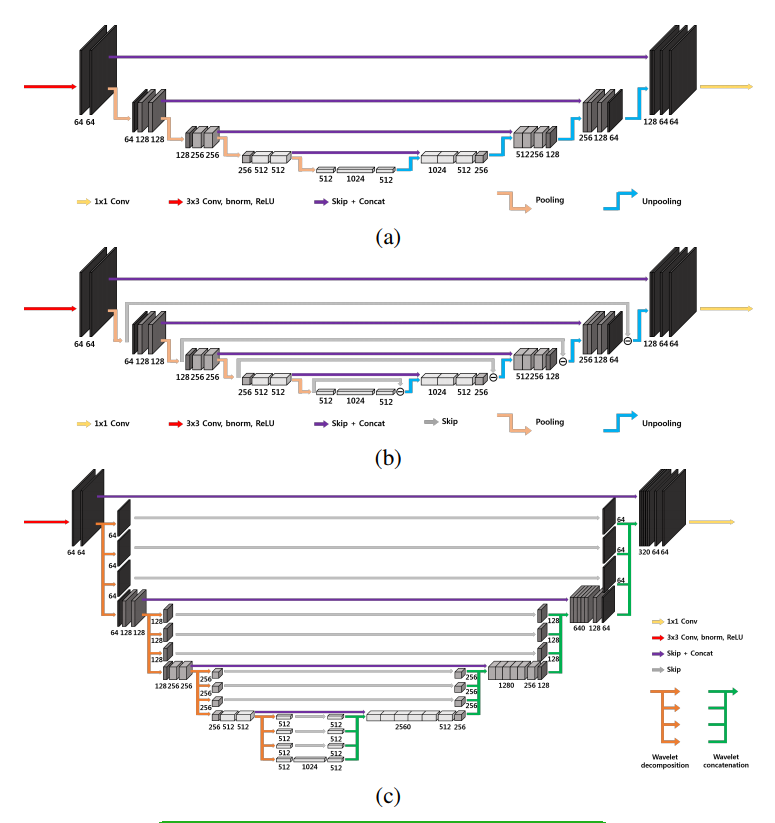

## Quick and naive implementation of framing U-net paper in Keras (tf backend)
This is a very straight-forward implementation of U-net, dual U-net, and tight U-net in Keras (after all I just spent a few hour to make this).
I checked all the models are working fine and they are actually used in my personal research. 
Since Keras does not allow me to change the batch dimension, I had to use Conv3D in tight U-net to make a wavdec and wavrec modules be multiplied for each channel.

paper link: [Framing U-Net via Deep Convolutional Framelets: Application to Sparse-view CT](https://arxiv.org/abs/1708.08333)

I followed the architecture in Fig. 4 of the paper.

